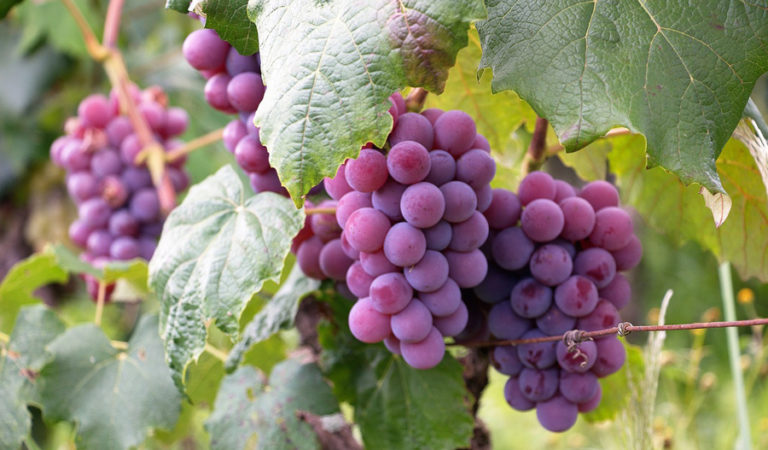
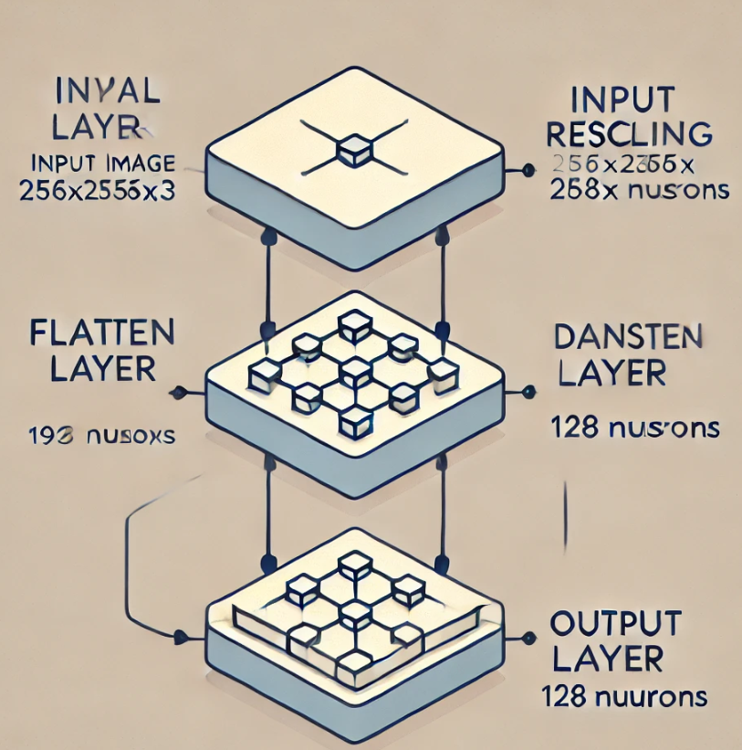

Text translated on translate.google EN. - Text in PT-BR 

    <em>EN</em>:

# Project: Image classification with grapevine leaves: Plant disease.

    Provisional IMG of the project:

###### Font IMG : https://saporedivino.com.br/o-ciclo-de-vida-das-videiras/ 

- ***Using convolutional neural networks***

In the project I tried to document as little as possible so that I could include it in the readme in a general way and without polluting it with too much development and code information.

**Importing Data**

The data was imported using the pathlib library, together with the .glob() method, which allows you to filter files with specific patterns, but without recursive searching.

**Obtaining Folder Names**

The folders variable was declared, where I applied a for loop to obtain the names of the subfolders within the main directory. As an example, we extracted the names of the folders containing images:

        ['BlackMeasles', 'BlackRot', 'HealthyGrapes', 'LeafBlight']

**First Image Processing**

After printing the folder names, I took the first image from the BlackMeasles class with:

        PIL.Image.open(str(blackMeasles[0]))

**Image Feature Extraction**

To analyze the dimensions of the images, the path to the subfolder was defined using the path variable. The images variable was created to store the images in the subfolder. Using:

        + list(path.glob("*.jpg"))

to ensure that images with different extensions were found.
Note: Since the formats "JPG" and "jpg" will be added together, if there are other formats, they should be treated separately.

**Image Verification and Conversion**

I implemented an if structure to ensure that there are images before opening any file. If there are images, the first one is opened and converted to a NumPy array for analysis. This ensures that the process occurs safely, avoiding errors if there are no images in the folder.

the images generated by img_array.shape returned (256, 256, 3), which is 256x256 pixels (width and height) and have three color channels, represented by the value 3. In other words, they are stored as tensors to load in batches (path). With "summary" we had the response where we obtained: Input: Image (256x256x3), Preprocessing Layer: Rescaling, Flatten Layer: Converts the image to a 1D vector (196608), Dense Layer 1: 128 neurons, 25M+ parameters and Dense Layer 2 (Output): 4 neurons, 516 parameters.

**image summary:**

###### Font IMG: Generated by A.I. - ChatGPT

The dataset was divided into one part for training and another for validation using "tf.keras.utils". After the division, a seed was chosen and the model was created with an input layer, rescaling pixel values, breaking the image as a sequence of numbers, creating a dense/hidden layer, and an output layer, then compiling the model.

---
---

    <em>PT-BR</em>:

# Projeto: Classificação de imagem com folhas de videiras : Doença de plantas.

    IMG provisoria do projeto:

###### Font IMG : https://saporedivino.com.br/o-ciclo-de-vida-das-videiras/ 

- ***Utilizando redes neurais convolucionais***

No projeto tentei documentar menos possivel para colocar no readme de forma geral e sem poluir com muito desenvolvimento e informação do codigo.

**Importação dos Dados**

A importação dos dados foi realizada utilizando a biblioteca pathlib, juntamente com o método .glob(), que permite filtrar arquivos com padrões específicos, mas sem busca recursiva.

**Obtenção dos Nomes das Pastas**

Foi declarada a variável pastas, onde apliquei um loop for para obter os nomes das subpastas dentro do diretório principal. Como exemplo, extraímos os nomes das pastas contendo imagens:

Saída:

        ['BlackMeasles', 'BlackRot', 'HealthyGrapes', 'LeafBlight']

**Processamento da Primeira Imagem**

Após imprimir os nomes das pastas, peguei a primeira imagem da classe BlackMeasles com:

        PIL.Image.open(str(blackMeasles[0]))

**Extração das Características da Imagem**

Para analisar as dimensões das imagens, foi definido o caminho para a subpasta usando a variável path. A variável images foi criada para armazenar as imagens da subpasta. Usando:

        + list(path.glob("*.jpg"))

para garantir que imagens com diferentes extensões fossem encontradas.
Observação: Como os formatos "JPG" e "jpg" serão somados, caso haja outros formatos, eles devem ser tratados separadamente.

**Verificação e Conversão das Imagens**

implementei uma estrutura if para garantir que haja imagens antes de abrir qualquer arquivo. Caso existam imagens, a primeira é aberta e convertida em um array NumPy para análise. Assim, garantindo que o processo ocorra de maneira segura, evitando erros caso não haja imagens na pasta.

as imagens geradas por img_array.shape retornou (256, 256, 3), que é 256x256 pixels (largura e altura) e possuem três canais de cor, representados pelo valor 3. Ou seja são armazeradas como tensores para carregar em lotes (path).Com "summary" tivemos a reposta onde se obteve: Entrada: Imagem (256x256x3), Camada de Pré-processamento: Rescaling, Camada de Flatten: Converte a imagem um vetor 1D (196608), Camada Densa 1: 128 neurônios, 25M+ parâmetros e a Camada Densa 2 (Saída): 4 neurônios, 516 parâmetros.

**summary em imagem:**

###### Font IMG : Gerada por I.A. - ChatGPT

Foi realizado a divisão dataset uma parte para treino e outro para validação utilizando "tf.keras.utils.". Após a divisão foi feita a escolha de uma seed e a criação do modelo com camada de entrada, reescalando valores dos pixels, quebrando a imagem como uma sequencia de numes, criando uma camada densa/escondida, e camada de saida, em seguida a copilação do modelo

apos plotar os resultadodos a acurácia ficou em torno de 0.8, tentando ver se tem como melhorar ainda mais, fui em busca dde camadas específicas para redes neurais que envolvem imagens assim usando outra técnica para melhorar a acurácia.

Adicionando camadas convolucionais, colocando agora, 32 filtros entao é 32 versoes, tamanho de 3x3 pixels com Conv2D, e reduzindo dimensionalidade com o MaxPooling2D.
com o modelo utilizando 10 epocas o grafico ficou em torno de 1 ate certo ponto, com summary foi visto os dados das camadas do modelo, fazendo um limite para as epocas com a class criada chamada "myCallback", quando atingir 0.93 ele vai parar de fazer as epocas. isso so um teste para ver ate onde iria.

Agora testando com mais epocas "50", os dados ficou com dados instaveis ao longo do tempo para melhorar foi adicionado o "Data Augmentation", para aumentar a base de dados, logo após fazendo as 50 epocas com o "Data Augmentation", e plotando o grafico. O resultado do grafico indicar certa instabilidade no treinamento da rede neural, além de poder indicar que não temos essas características que tentamos adicionar aos dados de validação, como a rotação e o zoom.

Sendo assim vou utilizando o modelo interceptionV3 ja trabalhado com ele em outro projeto no kaggle. Resumo do projeto: raixoX de penemunia, com 16 validação de image, treino 5216 treino, foi feito plotagem dos dados, sendo dados 80-20, o uso de correção usando o initial_bias, dados do modelo foram, Dense e Dropout.

Foi adicionado a forma do nosso input em uma variável

        input_shape = (256, 256, 3)

Foi baixado o "InceptionV3" além de passar trainable = False para que ele não seja treinavel, pegando a saída do modelo base para a compilação. Desta vez usando esse modelo so que com 20 epocas, a acuracia melhorou então foi feito o salvamento com dados brutos, e no modo otimizado com "include_optimizer", e convertendo e salvando com TensorFlow Lite
